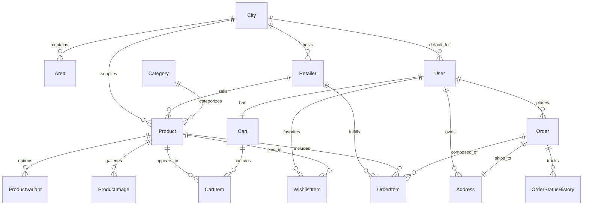

# Database Entity Relationship Diagram

Cities are seeded with the required six hyperlocal options (Delhi, Noida, Gurugram, Varanasi, Patna, Mumbai) ensuring every retailer and product inherits a location context for queries.

